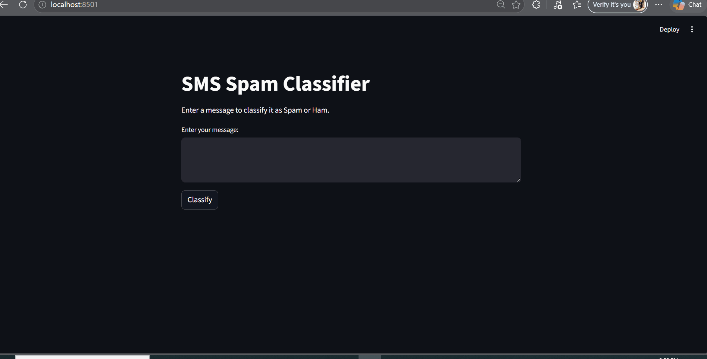

# Spam SMS Classifier 

This project is a Machine Learning-based web application that classifies SMS messages as either **Spam** or **Ham (Not Spam)** using Natural Language Processing (NLP) techniques and a Logistic Regression model.

The application was successfully deployed using Streamlit.

---

# Live Demo

The project is deployed on Streamlit and allows users to test SMS messages in real time through an interactive web interface.

---

# Project Features

- SMS Spam Detection using Machine Learning
- Text preprocessing using TF-IDF Vectorization
- Logistic Regression Classification Model
- Interactive Streamlit Web Application
- Real-time Predictions
- Clean and User-Friendly Interface

---

# Project Structure

```bash
Email_Classification/
│
├── app.py                         # Streamlit application
├── Email_Classification.ipynb    # Model training notebook
├── logistic_regression_model.pkl # Saved trained model
├── tfidf_vectorizer.pkl          # Saved TF-IDF vectorizer
├── requirements.txt              # Required libraries
├── Email.csv                       # Dataset
└── README.md                     # Project documentation
├── images/demo             # demo of project


```

---

# Project Description

This project demonstrates the complete workflow of building an NLP-based spam classifier system, including:

- Data loading and preprocessing
- Text cleaning and TF-IDF feature extraction
- Model training and evaluation
- Performance comparison
- Model serialization using Pickle
- Web app deployment using Streamlit

The goal is to accurately classify incoming SMS messages and identify unwanted spam messages.

---

# Dataset

The dataset used in this project is:

- `Email.csv'

It contains SMS messages labeled as:

- `spam`
- `ham`

---

# Models Used

The following machine learning models were trained and evaluated:

## 1. Multinomial Naive Bayes
A probabilistic model commonly used in NLP and text classification tasks.

## 2. Logistic Regression
A linear classification model known for its simplicity and strong performance in binary classification problems.

---

# Evaluation Metrics

Since spam datasets are usually imbalanced, multiple evaluation metrics were used:

- Accuracy
- Precision
- Recall
- F1-Score
- Confusion Matrix

These metrics provide a better understanding of model performance beyond simple accuracy.

---

# Technologies Used

- Python
- Scikit-learn
- Pandas
- NumPy
- Streamlit
- Pickle
- TF-IDF Vectorizer

---

# Setup and Installation

## 1. Clone the Repository

```bash
git clone https://github.com/AhmedKamel200058/Email_Classification.git
cd Email_Classification
```

---

## 2 Install Dependencies

```bash
pip install -r requirements.txt
```

---

# Run the Streamlit Application

Use the following command to run the app locally:

```bash
streamlit run app.py
```

After running the command, Streamlit will automatically open the application in your browser.

---

# Deployment

The project was deployed using Streamlit Community Cloud.

The deployed application loads:

- `logistic_regression_model.pkl`
- `tfidf_vectorizer.pkl`

to make real-time predictions on user-entered SMS messages.

---


# Application Preview

The Streamlit application allows users to:

- Enter an SMS message
- Click the "Classify" button
- Instantly receive a prediction:
  - Spam 🚨
  - Ham ✅
  
# Demo

